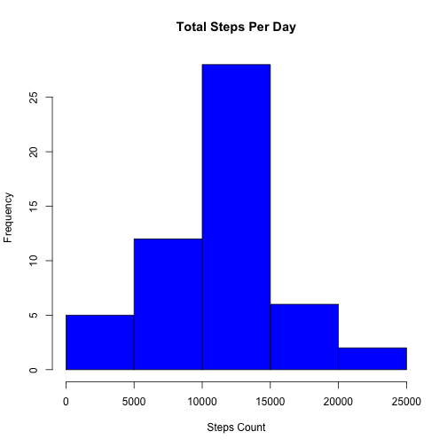
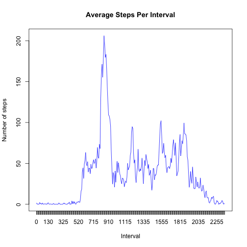
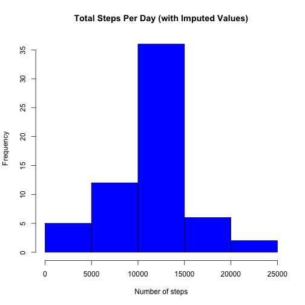
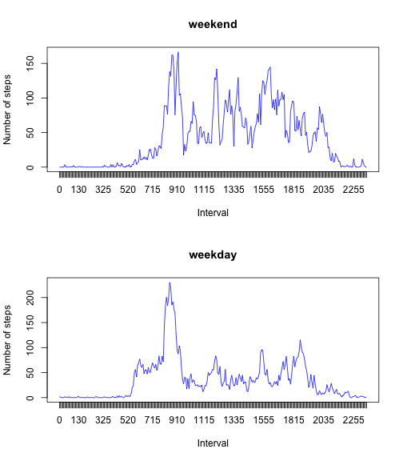

# Reproducible Research: Peer Assessment 1


## Loading and preprocessing the data

Preparing the workplace

```r
#set working directory (use your own)
setwd("~/Documents/RepData_PeerAssessment1/")

#check if working directory is set correctly
#getwd()
#list.files()
```
Download & unzip the data file

```r
#download the data file
download.file("https://d396qusza40orc.cloudfront.net/repdata%2Fdata%2Factivity.zip", destfile = "activity.zip", method = "curl")

#unzip the data file
unzip("activity.zip")

#read the data set into R
data <- read.csv("activity.csv", colClasses = c("numeric", "Date", "numeric"))

#examine the data set
summary(data)
```

```
##      steps            date               interval   
##  Min.   :  0.0   Min.   :2012-10-01   Min.   :   0  
##  1st Qu.:  0.0   1st Qu.:2012-10-16   1st Qu.: 589  
##  Median :  0.0   Median :2012-10-31   Median :1178  
##  Mean   : 37.4   Mean   :2012-10-31   Mean   :1178  
##  3rd Qu.: 12.0   3rd Qu.:2012-11-15   3rd Qu.:1766  
##  Max.   :806.0   Max.   :2012-11-30   Max.   :2355  
##  NA's   :2304
```

## What is mean total number of steps taken per day?
Making the histogram plot

```r
#calculate the total number of steps per day
tdsteps <- tapply(data$steps, data$date, sum)

#make a histogram of the total number of steps taken each day
hist(tdsteps, main = "Total Steps Per Day", xlab = "Steps Count", col = "blue")
```

 

Calculate the mean & median

```r
#calculate summary statistics for total steps per day with an accurate option
options(scipen = 999, digits = 8)
summary_stats <- summary(tdsteps)
mean_steps <- summary_stats["Mean"]
median_steps <- summary_stats["Median"]

#print the summary statistics, mean and median for total steps per day
print(summary_stats)
```

```
##    Min. 1st Qu.  Median    Mean 3rd Qu.    Max.    NA's 
##      41    8841   10765   10766   13294   21194       8
```

```r
print(mean_steps)
```

```
##  Mean 
## 10766
```

```r
print(median_steps)
```

```
## Median 
##  10765
```

## What is the average daily activity pattern?
Time series plot of the 5-minute interval (x-axis) and the average number of steps taken, averaged across all days (y-axis)

```r
#calculate the average steps for each interval (acrossall days)
mean_steps <- tapply(data$steps, data$interval, function(x) mean(x, na.rm = T))

# Make a plot (type = 'l')
# (x-axis) and the average number of steps taken, averaged across all days
# (y-axis)
x_axis <- 1:length(mean_steps)
plot(as.integer(x_axis), mean_steps, type = "l", main = "Average Steps Per Interval", xlab = "Interval", ylab = "Number of steps", xaxt = "n", col = "blue")
axis(1, at = x_axis, names(mean_steps))
```

 

```r
#which 5-minute interval, on average across all the days in the dataset, contains the maximum number of steps?
max_mean <- max(mean_steps)
highest_average <- mean_steps[mean_steps == max_mean]

summary(mean_steps)
```

```
##     Min.  1st Qu.   Median     Mean  3rd Qu.     Max. 
##   0.0000   2.4858  34.1130  37.3830  52.8350 206.1700
```
The 5-minute interval with the highest number of steps on average is 
**835**.   
It has an average of **206** steps.

## Imputing missing values

```r
#calculate and report the total number of missing values in the dataset (i.e. the total number of rows with NAs)
missing_values <- sum(!complete.cases(data))
```

The total number of rows with missing values is **2304**.  


```r
#fill in missing data with the mean for the 5-minute interval.
#create a new dataset that is equal to the original dataset but with the missing data filled in.
filled_data <- data
for (i in 1:nrow(data)) {
    if (is.na(data$steps[i])) {
        filled_data$steps[i] <- mean_steps[as.character(data$interval[i])]
    } 
}

#histogram of the total number of steps taken each day.
steps2 <- tapply(filled_data$steps, filled_data$date, sum)
hist(steps2, main="Total Steps Per Day (with Imputed Values)", xlab="Number of steps", col="blue")
```

 

```r
#calculate and report the mean and median total number of steps taken per day 
summary_stats2 <- summary(steps2)
mean_steps2 <- summary_stats2["Mean"]
median_steps2 <- summary_stats2["Median"]

#summary statistics for total steps per day
print(summary_stats2)
```

```
##    Min. 1st Qu.  Median    Mean 3rd Qu.    Max. 
##      41    9819   10766   10766   12811   21194
```
The mean total steps per day is **10766**.  
The median total steps per day is **10766**.  


```r
#create a data frame to hold the summaries of the original data set and the filled-in data set
cmp.df <- data.frame(rbind(summary_stats[1:6], summary_stats2),
                     row.names=c("Original", "Filled-in (imputed)"))
cmp.df[, names(summary_stats[7])] <- c(summary_stats[7], 
                     sum(!complete.cases(filled_data)))
names(cmp.df) <- names(summary_stats)

#use xtable to make a pretty display
library(xtable)
cmp.table <- xtable(cmp.df, display=c("s", "d", "d", "d", "d", "d", "d", "d"),
                    caption="Total Steps Per Day Summary")
print(cmp.table, type="html", caption.placement="top")
```

<!-- html table generated in R 3.0.2 by xtable 1.7-3 package -->
<!-- Fri Jul 11 00:00:38 2014 -->
<TABLE border=1>
<CAPTION ALIGN="top"> Total Steps Per Day Summary </CAPTION>
<TR> <TH>  </TH> <TH> Min. </TH> <TH> 1st Qu. </TH> <TH> Median </TH> <TH> Mean </TH> <TH> 3rd Qu. </TH> <TH> Max. </TH> <TH> NA's </TH>  </TR>
  <TR> <TD align="right"> Original </TD> <TD align="right">  41 </TD> <TD align="right"> 8841 </TD> <TD align="right"> 10765 </TD> <TD align="right"> 10766 </TD> <TD align="right"> 13294 </TD> <TD align="right"> 21194 </TD> <TD align="right">   8 </TD> </TR>
  <TR> <TD align="right"> Filled-in (imputed) </TD> <TD align="right">  41 </TD> <TD align="right"> 9819 </TD> <TD align="right"> 10766 </TD> <TD align="right"> 10766 </TD> <TD align="right"> 12811 </TD> <TD align="right"> 21194 </TD> <TD align="right">   0 </TD> </TR>
   </TABLE>

**Comparison between original data set and filled-in data set:**  
1. the original and filled in data sets have the same *min*, *max*,
   and *mean* values.  
2. the *median* of the filled-in data set is only very slightly bigger than
   the original data set.  
3. the two data sets differ in their *1st quartile* and *3rd quartile* values.

## Are there differences in activity patterns between weekdays and weekends?

```r
#create a new factor variable in the dataset with two levels – “weekday” and “weekend” indicating whether a given date is a weekday or weekend day.
day_of_week <- weekdays(filled_data$date)
#slovak locale - that means slovak names of days.
weekends <- c("sobota", "nedeľa")#saturday, sunday
weekdays <- c("pondelok", "utorok", "streda", "štvrtok", "piatok")#monday, tuesday, etc.

filled_data$day_of_week[day_of_week %in% weekends] <- "weekend"
filled_data$day_of_week[day_of_week %in% weekdays] <- "weekday"
filled_data$day_of_week <- factor(filled_data$day_of_week)

#make a panel plot containing a time series plot (i.e. type = "l") 
#of the 5-minute interval (x-axis) and the average number of steps taken, 
#averaged across all weekday days or weekend days (y-axis). 
mean_steps2 <- tapply(filled_data$steps, 
    filled_data$interval, 
    function(x) {mean(x, na.rm=T)})

day.split <- split(filled_data, filled_data$day_of_week)
weekday.data <- day.split$weekday
weekend.data <- day.split$weekend

mean.per.interval.weekdays <- tapply(weekday.data$steps, 
    weekday.data$interval, 
    function(x) {mean(x)})
mean.per.interval.weekends <- tapply(weekend.data$steps, 
    weekend.data$interval, 
    function(x) {mean(x)})

par(mfrow=c(2,1))
x.axis.range <- 1:length(mean.per.interval.weekends)
plot(x.axis.range, 
    mean.per.interval.weekends, type="l", main="weekend",
    xlab="Interval", ylab="Number of steps", xaxt="n", col="blue")
axis(1, at=x.axis.range, names(mean.per.interval.weekends))

x.axis.range <- 1:length(mean.per.interval.weekdays)
plot(x.axis.range, 
    mean.per.interval.weekdays, type="l", main="weekday",
    xlab="Interval", ylab="Number of steps", xaxt="n", col="blue")
axis(1, at=x.axis.range, names(mean.per.interval.weekdays))
```

 

#yes, i like blue color in plots :)
